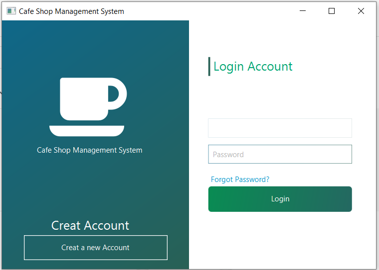
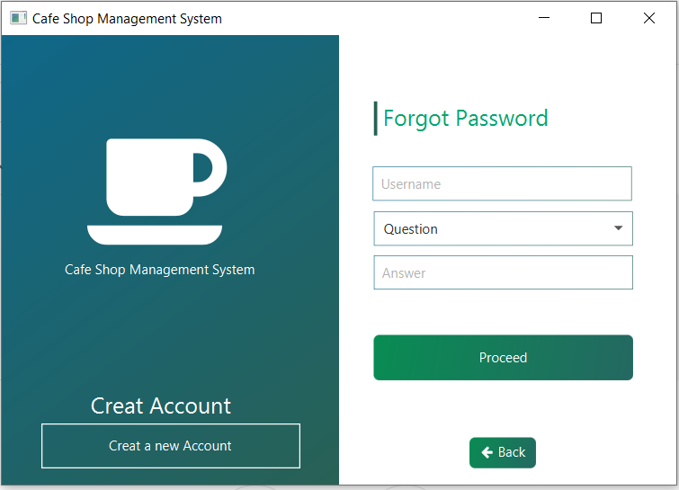
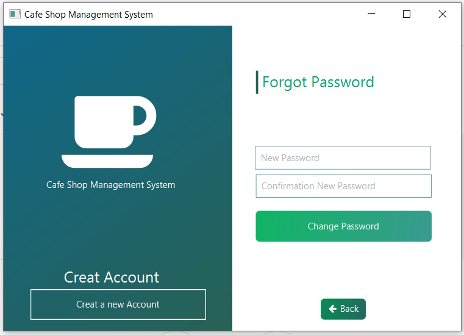
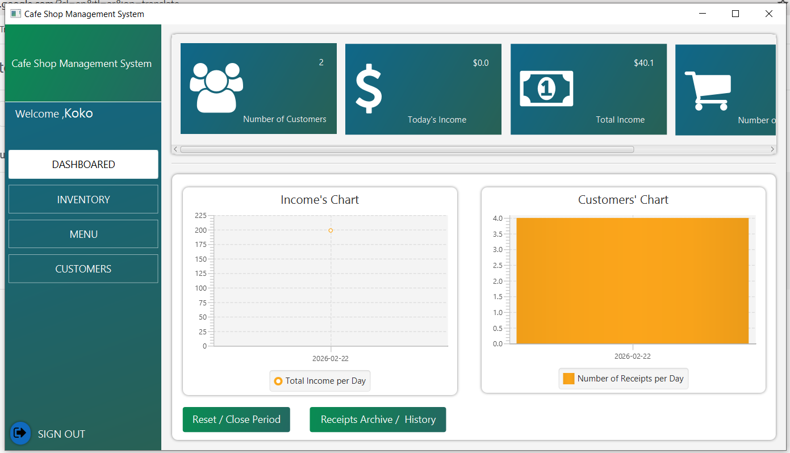
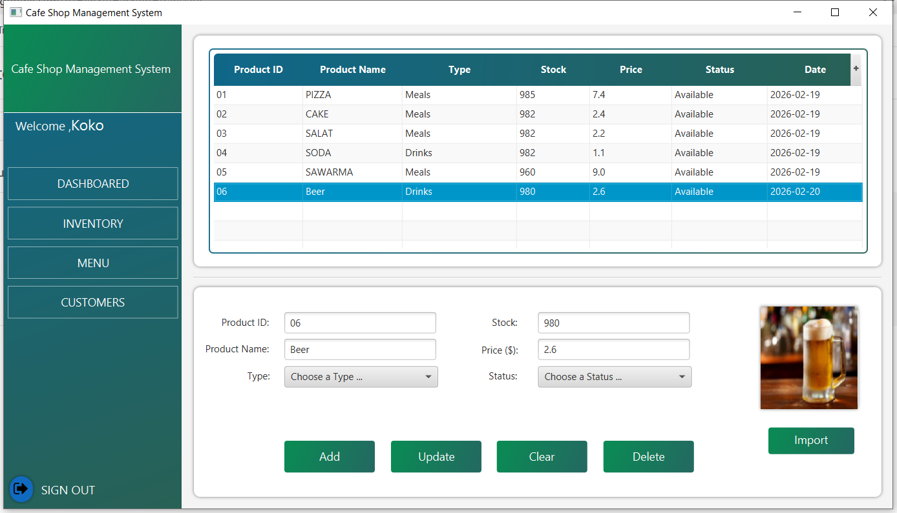
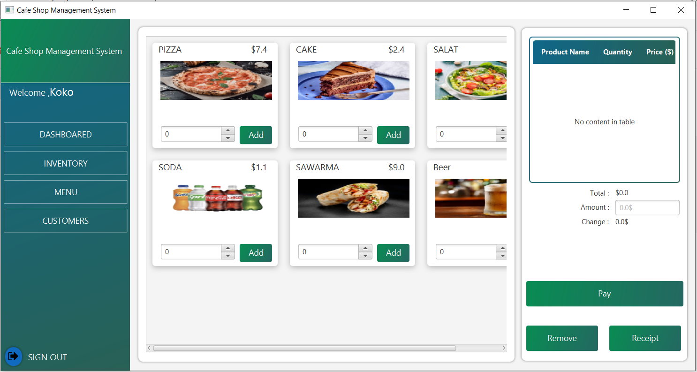
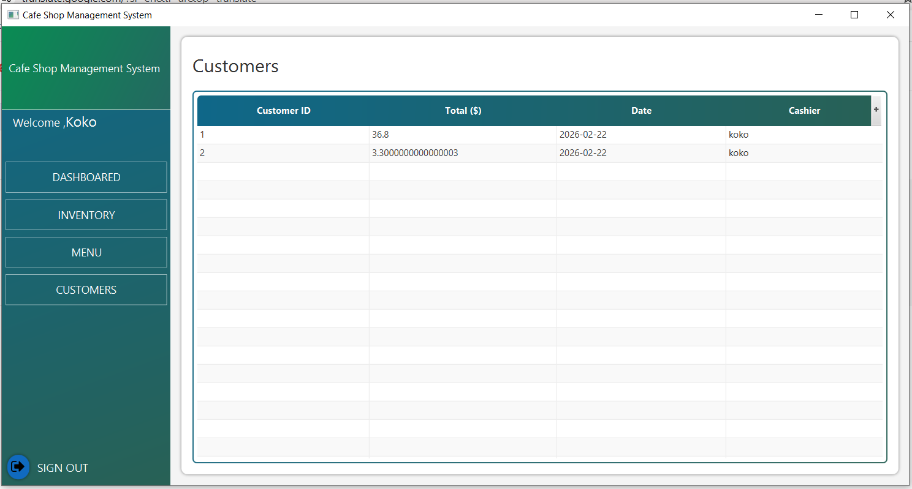

# Cafe Shop Management System (JavaFX + MySQL)

A JavaFX desktop POS system for a cafe/restaurant.  
It includes inventory management with product images, order workflow, payment & receipt printing, customers history, and a dashboard with sales charts.  
Data is stored in a MySQL database (managed via phpMyAdmin).

---

## Features

- **Authentication**: Login / Register + forgot password.
- **Dashboard**:
  - Summary cards:
    - Number of Customers
    - Today’s Income
    - Total Income
    - Number of Sold Products
  - Charts:
    - Income’s Chart (Total Income per Day)
    - Customers’ Chart (Number of Receipts per Day)
  - Actions:
    - Reset / Close Period
    - Receipts Archive / History (Archive of Receipts):
      - Receipts List / Transactions table columns:
        - Receipt ID
        - Customer ID
        - Date
        - Total
        - Cashier
    - Receipt Details section:
     - Shows Cashier name
     - Details table columns:
        - Customer ID
        - Type
        - Qty
        - Price
  - Printing:
    - Print Details (prints selected receipt details)
    - Print All Receipts
- **Inventory**:
  - Add / update / clear / delete products
  - Stock, price, status, type
  - Import product images
- **Menu & Orders**:
  - Product cards with images
  - Add items with quantities to cart
  - Payments & Receipts:
      - Payment with total/amount/change
      - Generate receipt and **print**
      - Delete an order **Remove**
- **Customers**:
  - View customers served with totals, date, cashier

---

## Tech Stack

- Java
- JavaFX
- MySQL (phpMyAdmin)
- Maven (`pom.xml`)
- NetBeans (project)

---

## Project Structure (important files)

- **Main class**: `src/main/java/com/mycompany/cafeshopmanagementsystemtest/App.java`
- **Database connection**: `src/main/java/com/mycompany/cafeshopmanagementsystemtest/database.java`

> ⚠️ Do not commit real database passwords. Use placeholders or a local config file ignored by Git.

---

## Database Setup (MySQL)

1. Create a database in phpMyAdmin (example: `cafe_shop_db`).
2. Create the required tables (products, orders, receipts, customers, etc.)
3. Update your DB credentials in:
   - `database.java` (host / port / db name / username / password)

If you have an `.sql` export, import it using phpMyAdmin for fastest setup.

---

## How to Run

### Run from NetBeans (recommended)
1. Open the project in NetBeans.
2. Let Maven download dependencies.
3. Run the main class: `App.java`

---

## Database Tables (Schema Overview)

Database name: `cafe`

### `product`
Stores menu/inventory items.
- `id` (PK, auto increment)
- `prod_id` (varchar)
- `prod_name` (varchar)
- `type` (varchar) — e.g. Meals / Drinks
- `stock` (int)
- `price` (double)
- `status` (varchar) — e.g. Available
- `image` (varchar(500)) — image path
- `date` (date)

### `employee`
Stores user accounts (cashiers/admin).
- `id` (PK, auto increment)
- `username` (varchar)
- `password` (varchar)
- `question` (varchar) — recovery question
- `answer` (varchar) — recovery answer
- `date` (date)

### `receipt`
Stores receipt header (transaction summary).
- `id` (PK, auto increment)
- `customer_id` (int)
- `total` (double)
- `date` (date, nullable)
- `em_username` (varchar) — cashier username

### `customer`
Stores receipt line items (products sold per customer/receipt flow).
- `id` (PK, auto increment)
- `customer_id` (int)
- `prod_id` (varchar)
- `prod_name` (varchar)
- `type` (varchar)
- `quantity` (int)
- `price` (double)
- `date` (date, nullable)
- `image` (varchar(500))
- `em_username` (varchar) — cashier username

### Archive tables
Used for history/archiving old data.

#### `receipt_archive`
- `id` (PK, auto increment)
- `customer_id` (int)
- `total` (double)
- `date` (date)
- `em_username` (varchar)
- `archived_at` (timestamp)

#### `customer_archive`
- `id` (PK, auto increment)
- `receipt_id` (int)
- `customer_id` (int)
- `prod_id` (varchar)
- `prod_name` (varchar)
- `type` (varchar)
- `quantity` (int)
- `price` (double)
- `date` (date)
- `em_username` (varchar)
- `archived_at` (timestamp)

### `monthly_close`
Stores monthly/period summary shown in dashboard.
- `id` (PK, auto increment)
- `month_year` (varchar(7)) — e.g. 2026-02
- `total_income` (double)
- `total_receipts` (int)
- `sold_products` (int)
- `created_at` (timestamp)

---
## Screenshots

### Login

### Sign Up

### Forgot Password

### Dashboard

### Inventory

### Menu / Order

### Customers

### Receipts Archive / History

### Reset / Close Period

